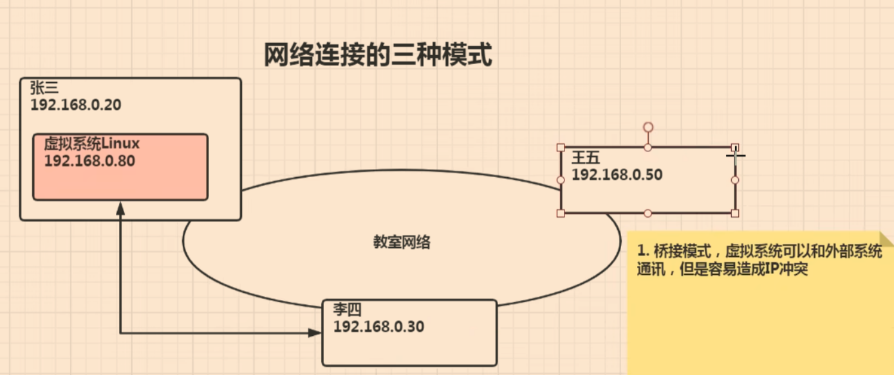
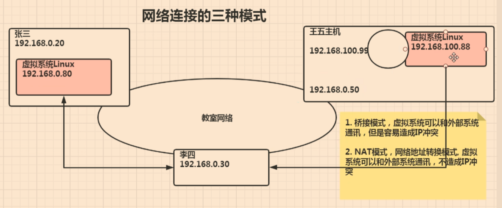
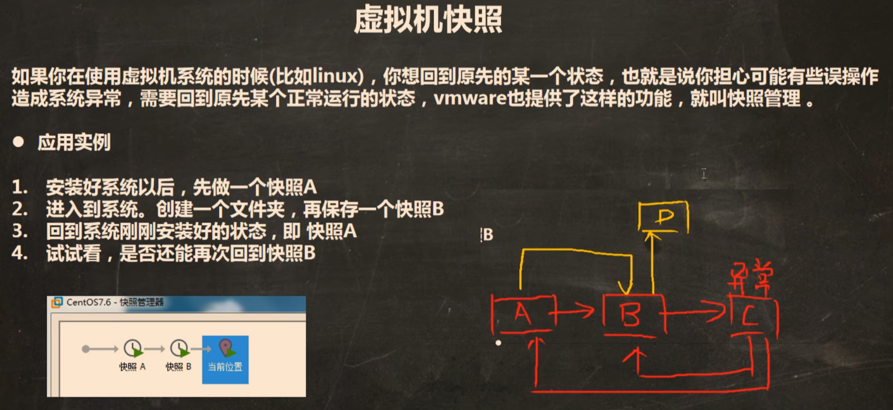
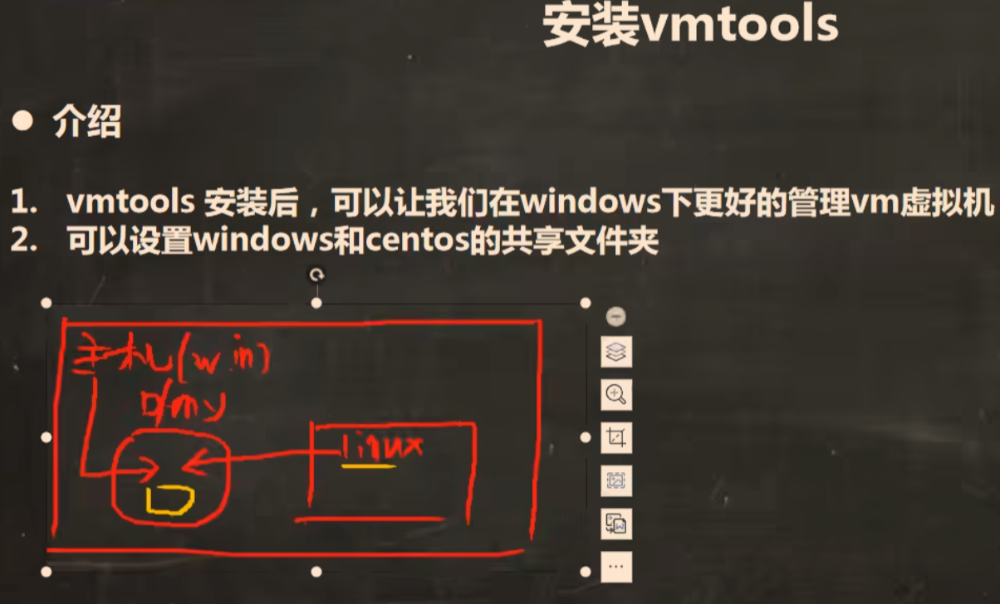
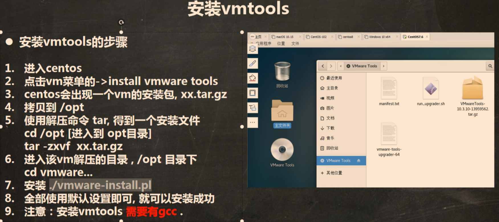
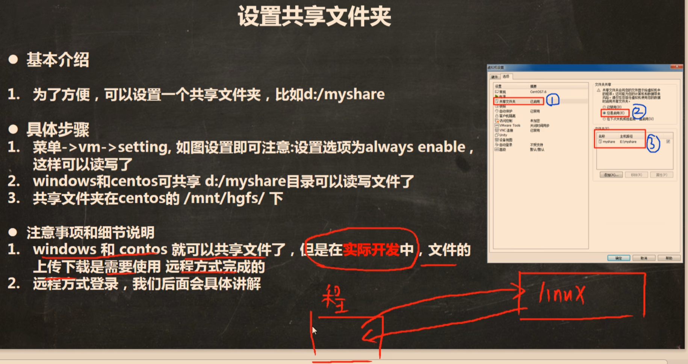

# Linux01

（01-11）

### 1.安装linux：CentOS7

### 2.网络的三种连接模式

#### 		(1).桥接模式

#### 		(2).NAT模式

注意：（李四和王五的linux的通讯线是单向的）

#### 		(3).主机模式

​		即独立的系统，随便配

### 3.虚拟机克隆（复制一份）和快照（系统还原点）

### 4.安装VMtools

## 进入到：cd /

### 5.设置共享文件夹

