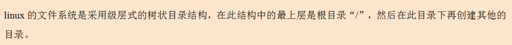
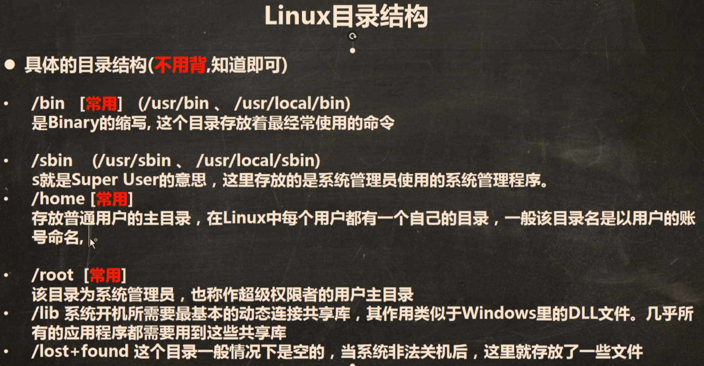
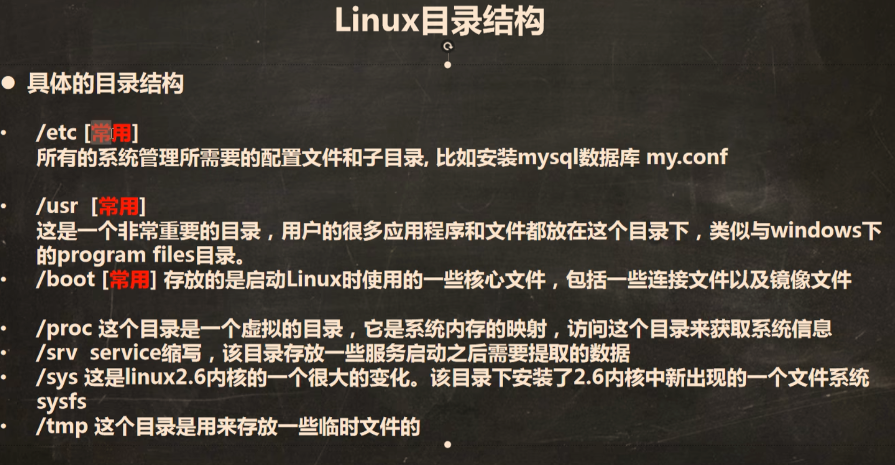
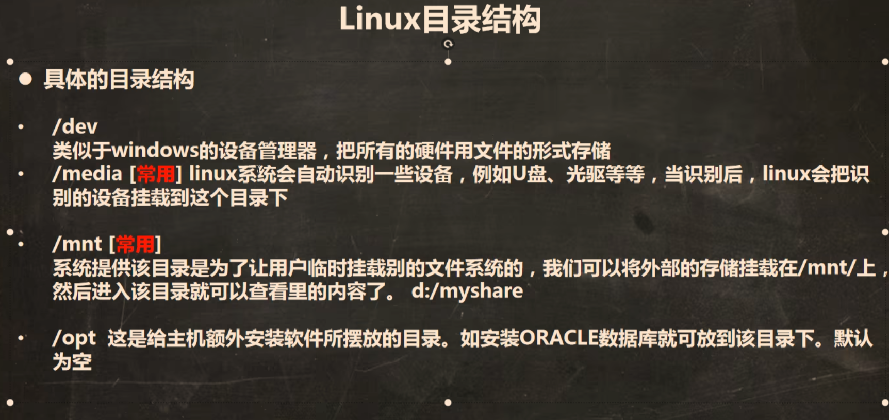
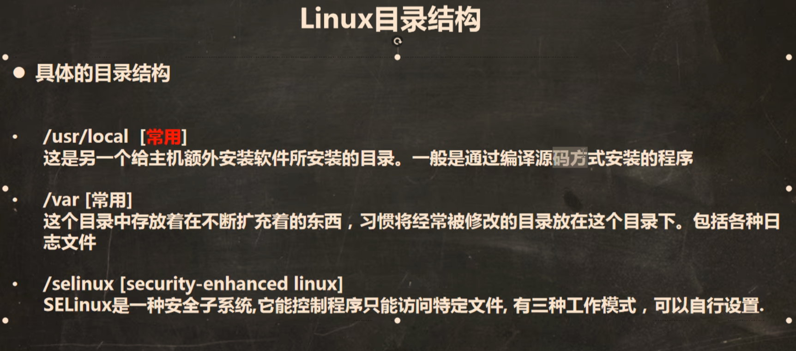
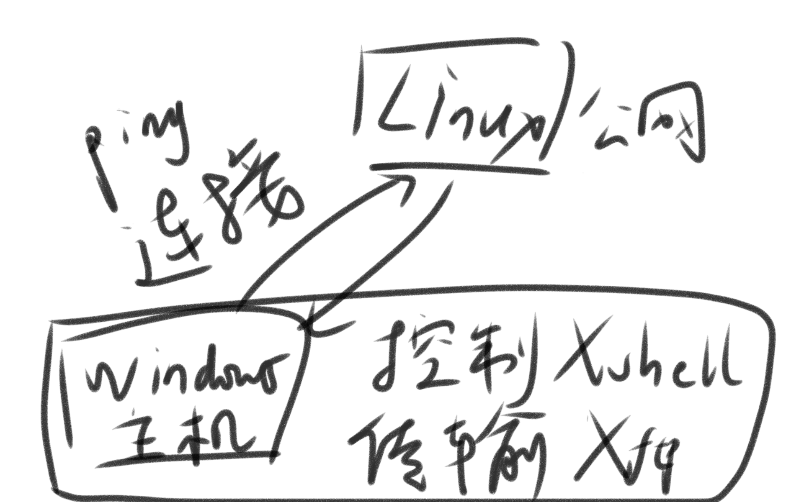
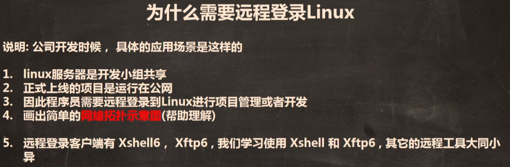
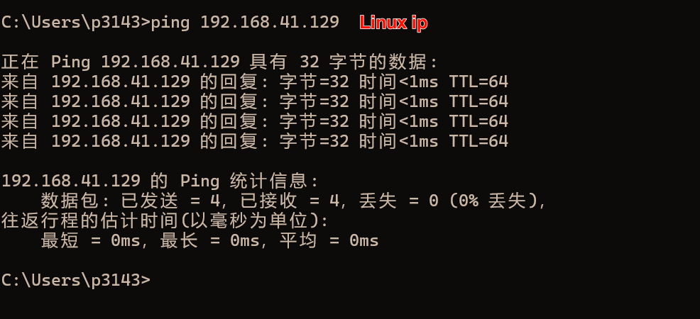
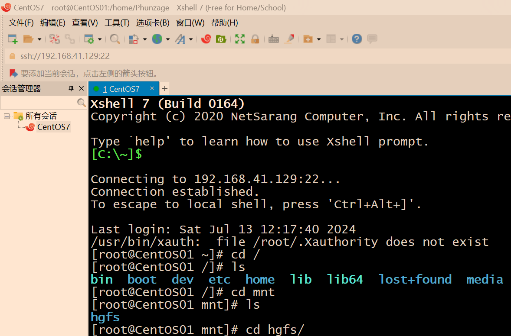
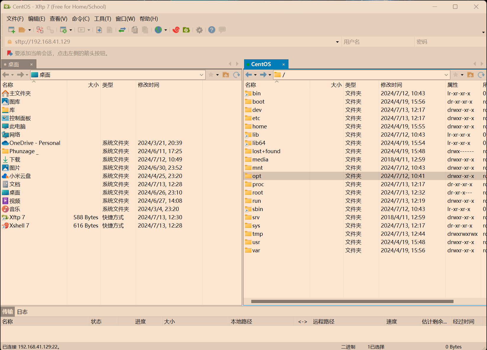

# Linux02

（12-20）

### 1.linux是目录结构，不同于Windows的树结构

​	Linux中，硬件会被映射成文件来使用

### 2.远程登录到Linux服务器

​	

1）下载Xshell，Xftp

2）测试ping联通：

​	linux查看ip地址：ifconfig 得到 Linux ip

​	在Windows cmd使用ping Linux ip

​	

3）在Xshell访问Linux（填主机名称和端口号）

​	

### 3.与远程Linux进行文件传输

​	1）下载Xftp

​	2）Xftp截图：

​	

