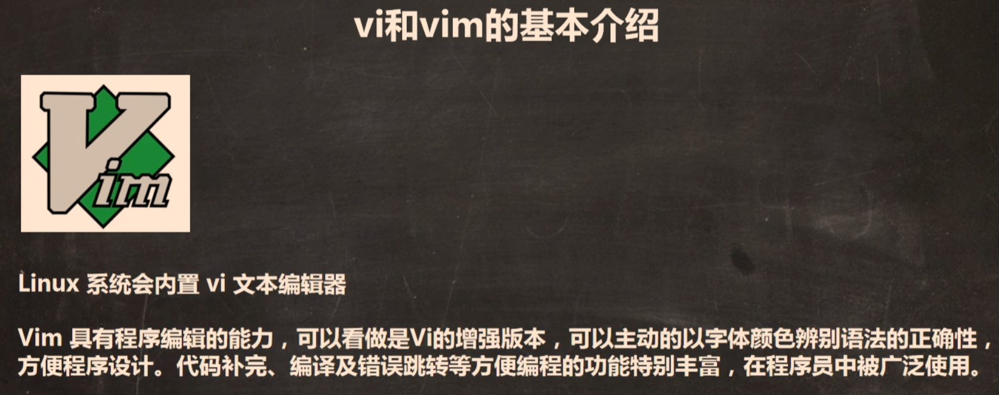
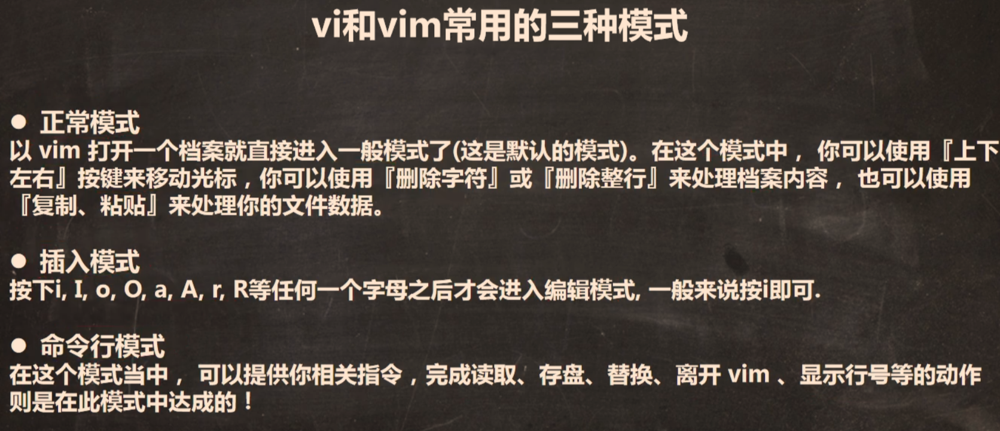
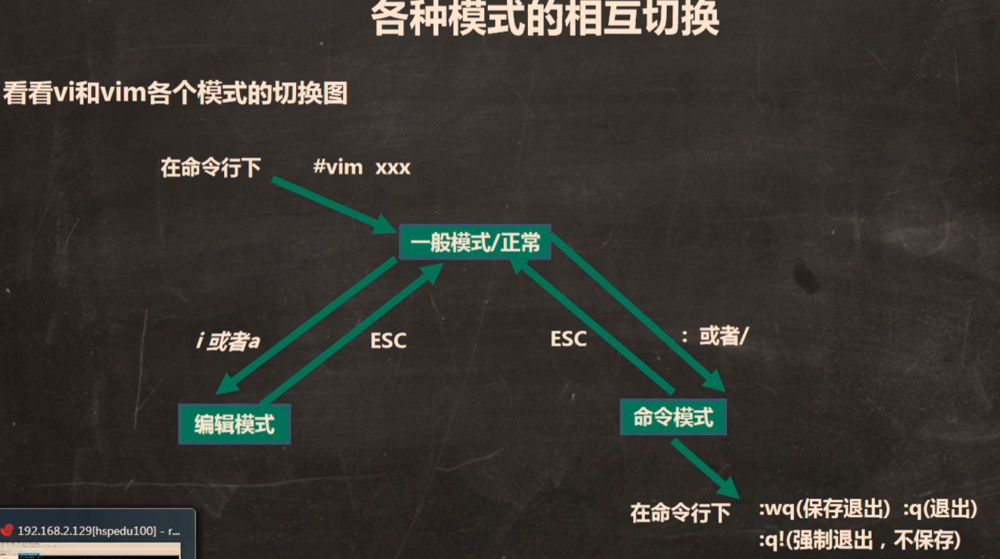
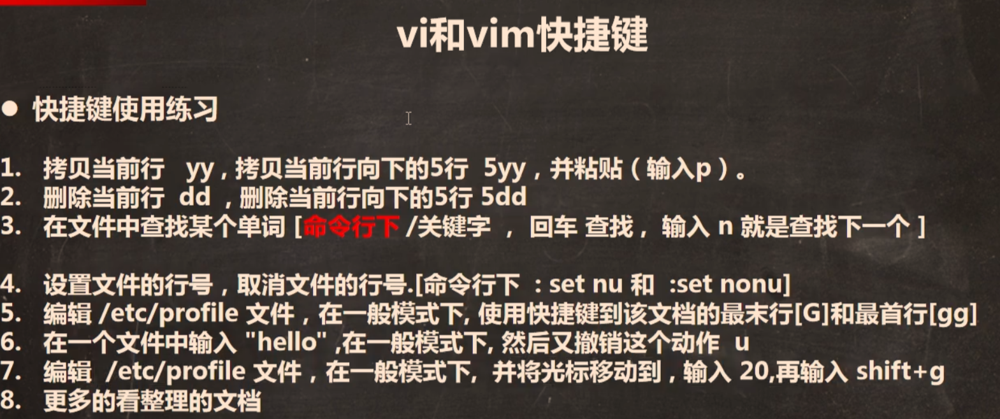

# Linux03_vi和vim

### 1.认识vi和vim







### 2.编辑使用

```
vim hello.java

(进入vim一般模式)
按i 进入编辑模式

public class hello {
	public static void main(String[] args) {
		System.out.println("hello_world!");
	}
}

写完后按ESC键进入一般模式，按:或/键进入命令行模式，此时看上面图片，一般是输入wq回车
```

常用快捷键（一般模式下使用）：

yy，nyy，p，dd，ndd，set nu，set nonu，gg，G，n shift+g，u

