# Linux05_用户管理

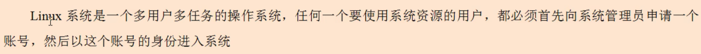

### 1.添加用户

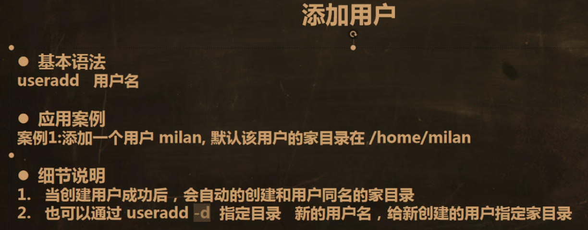

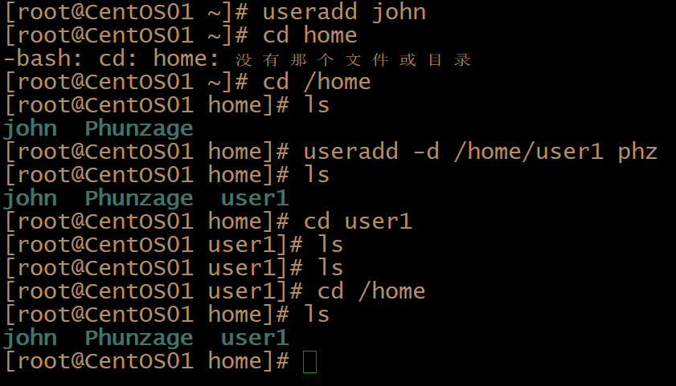	

> [!NOTE]
>
> 注意：
>
> ​	1）创建新用户要在root用户下创建
>
> ​	2）两种代码格式：
>
> ```
> 	1.useradd john（用户名）
> 	2.useradd -d /home/test phz（在home文件夹下创建了一个属于phz用户的文件夹test）
> ```

### 2.更改用户密码

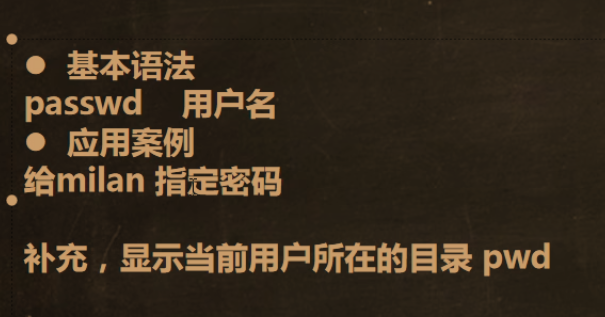	

### 3.删除用户

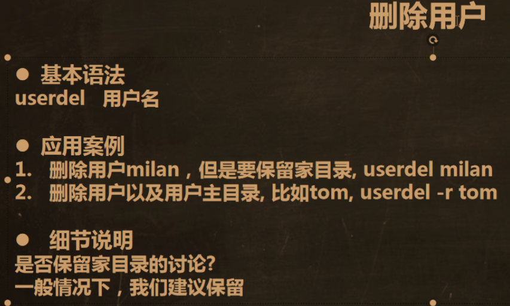	

### 4.访问用户信息

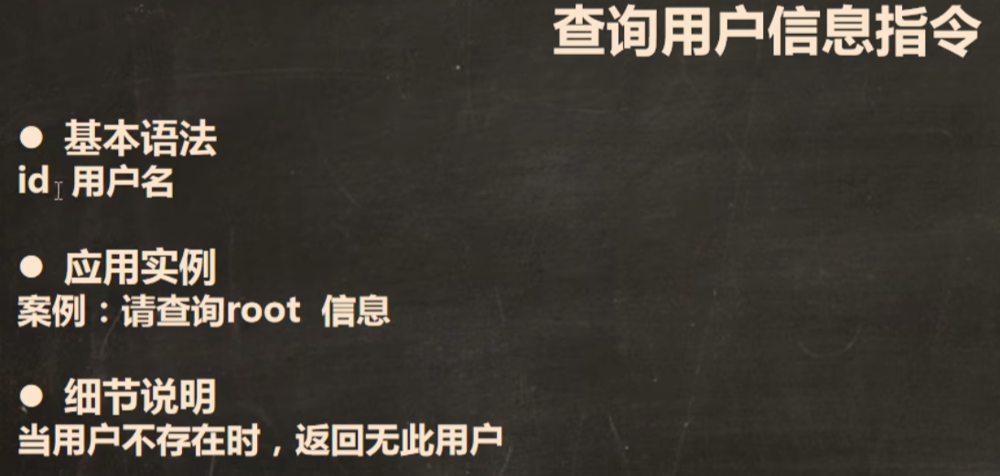	

### 5.切换用户

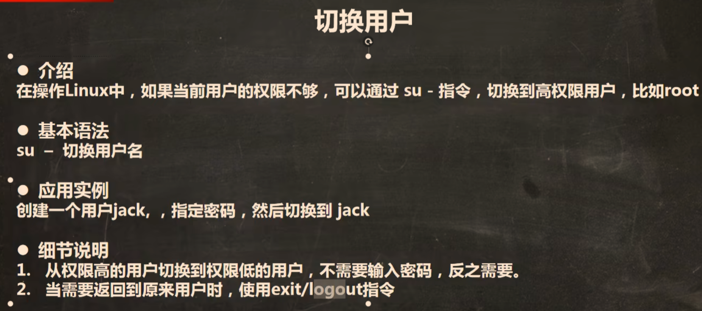

> [!NOTE]
>
> ###### 	都可一直回退到上个用户，但 logout 更专注于结束登录会话，而 exit 是一个更通用的命令，用于从各种环境退出
>
> ###### 	在Linux图形界面的终端，可以使用 exit 以退出终端


### 6.查看当前用户/登录用户

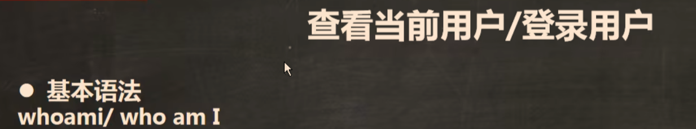

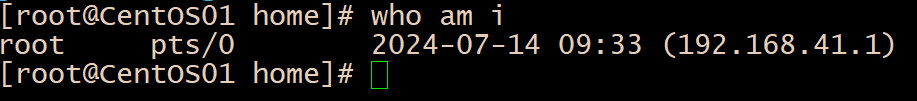	

### 7.用户组相关

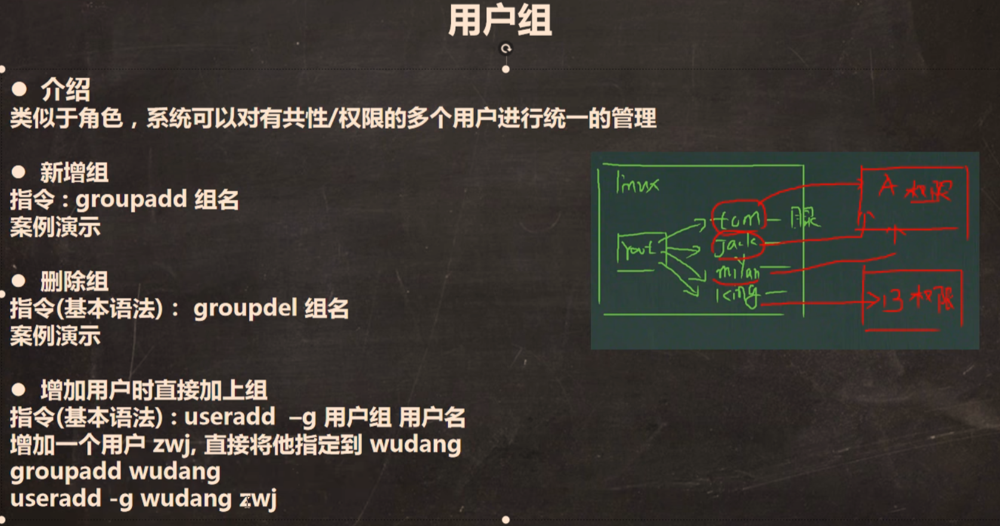

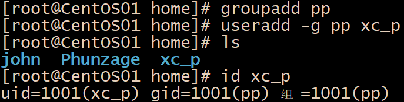	

​	

> [!NOTE]
>
> 未定义组而直接 useradd 用户，则此用户默认在以这个用户名命名的组中
>
> 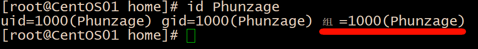

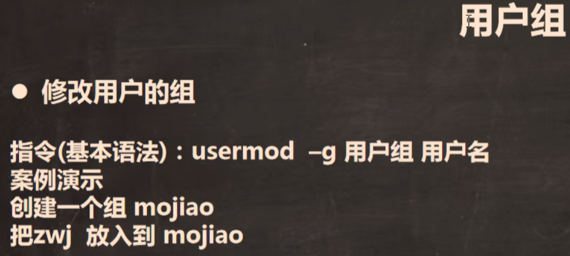

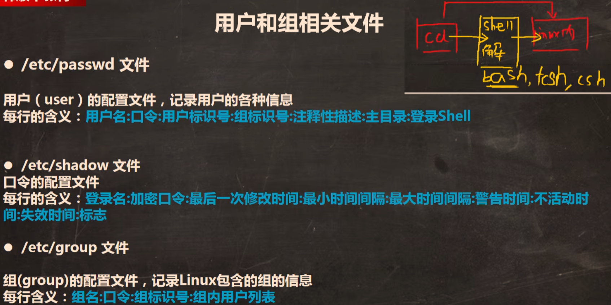