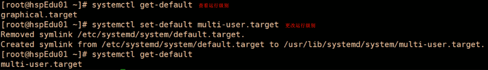
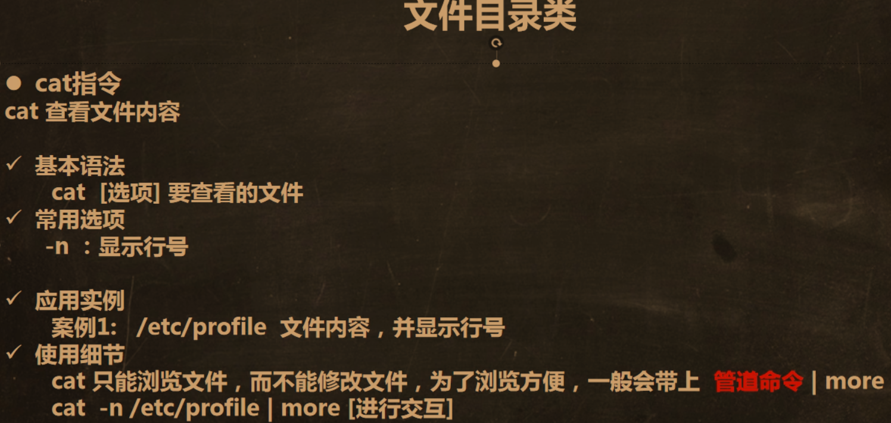

# Linux06_实用指令

## 1.切换运行级别

​	分类：




#### 切换运行级别的命令：

```
init 3/5
```

___

## 2.找回root密码：https://blog.csdn.net/qq_42402854/article/details/103821032

	

___

## 3.Linux帮助指令


​	其中案例2：

			





