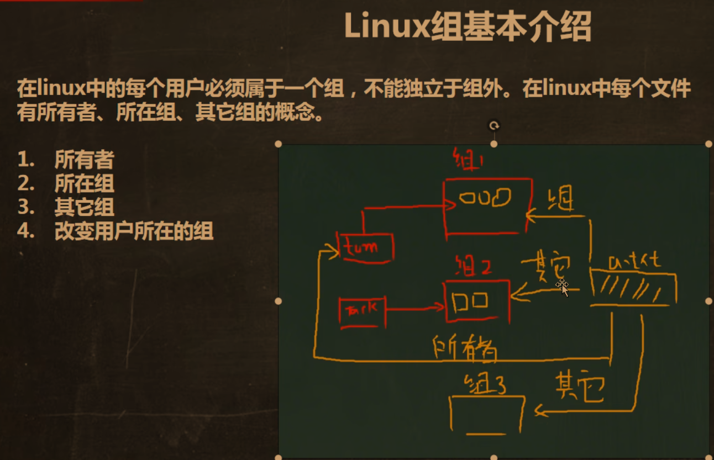
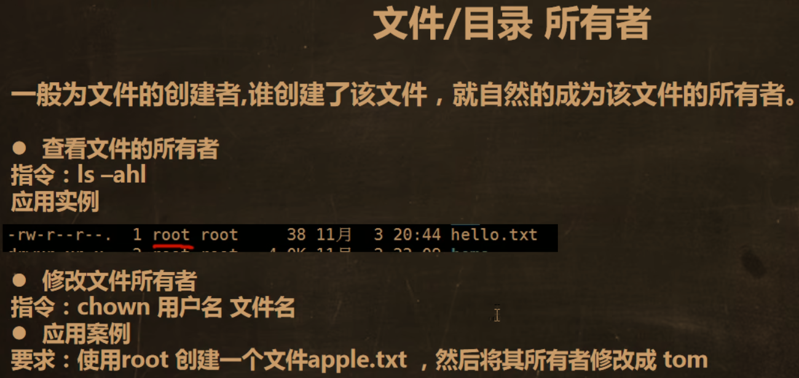
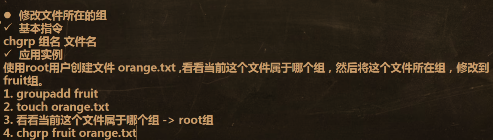
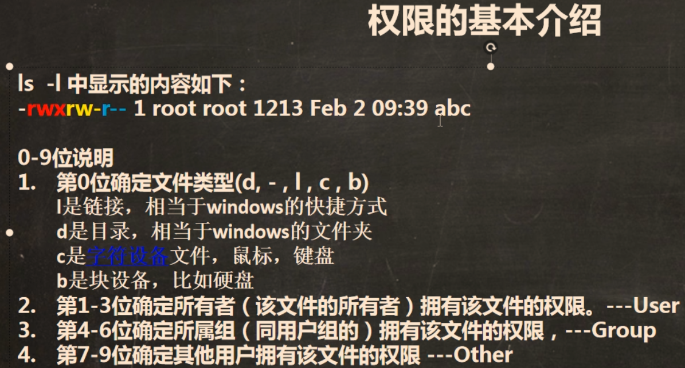
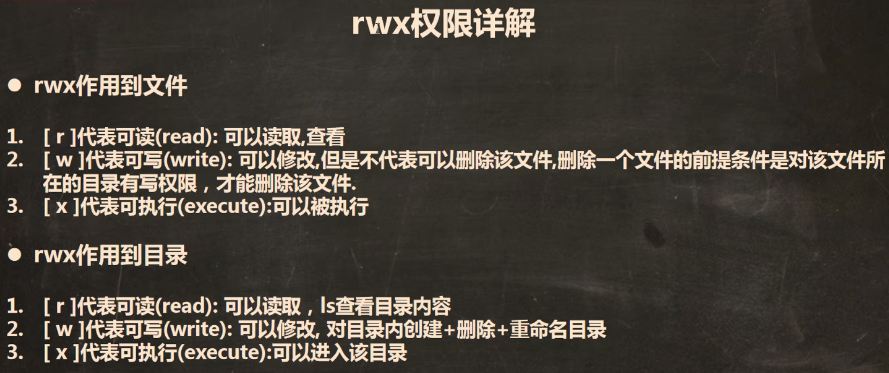
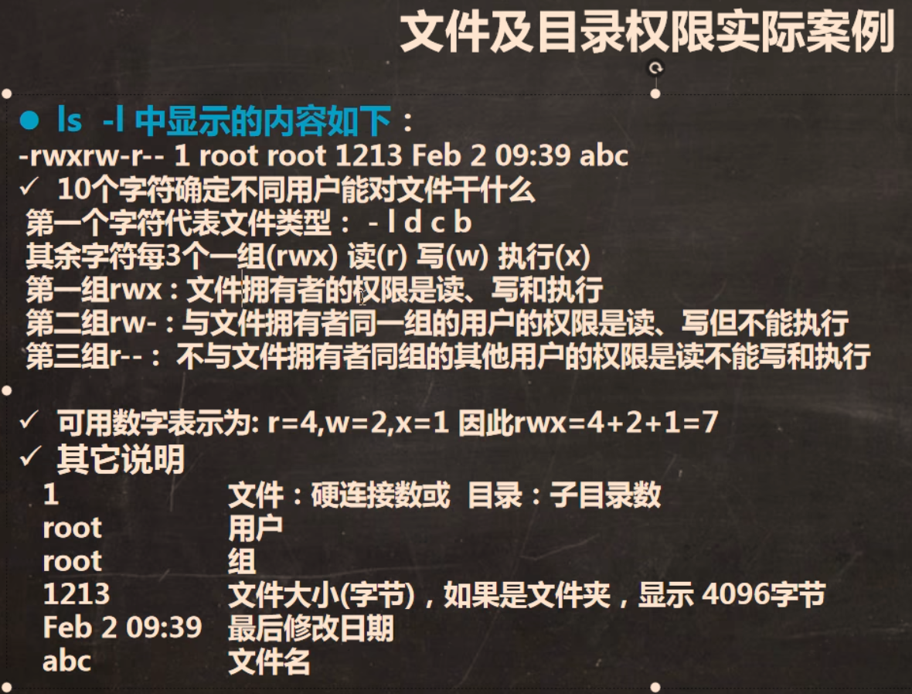
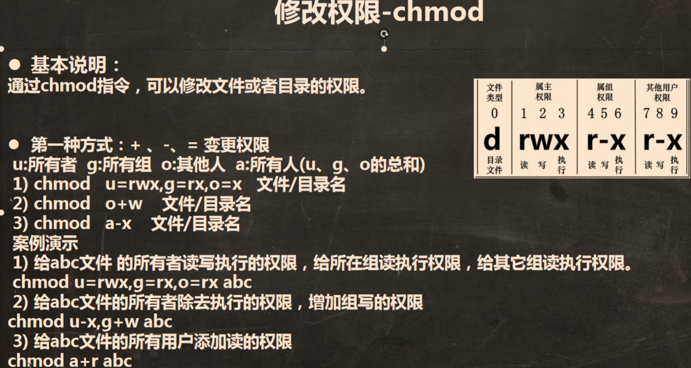
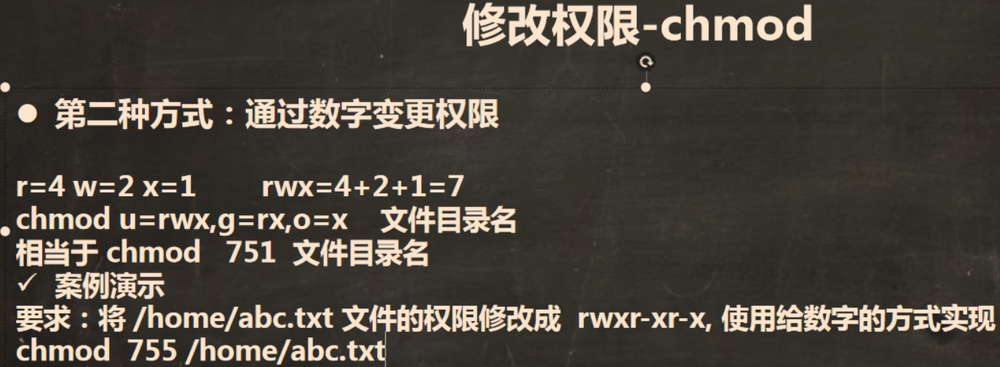
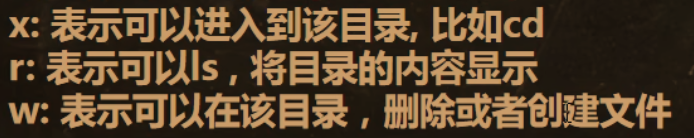

# Linux07_组与权限相关

## 1.组，所有者，所在组，其他组

___

## 2.查看及更改文件所有者

___

## 3.更改文件所在组

___

## 4.权限相关

### 	4.1查看权限

### 	4.2修改权限（两种方法）

___

## 5.权限重点：

### 对目录：

### 有 r 权限，可将目录的内容显示，即能用 ls 指令；无 r 权限，不能用 ls，但对目录下的文件该有的权限都可以操作

### 有 w 权限，即能对目录下的文件进行创建和删除；无 w 权限，即不能对目录下的文件进行创建和删除

### 有 x 权限，即可以进入到目录；无 x 权限，无法进入到该目录

	