# Linux08_定时任务调度

## 1.crond 任务调度

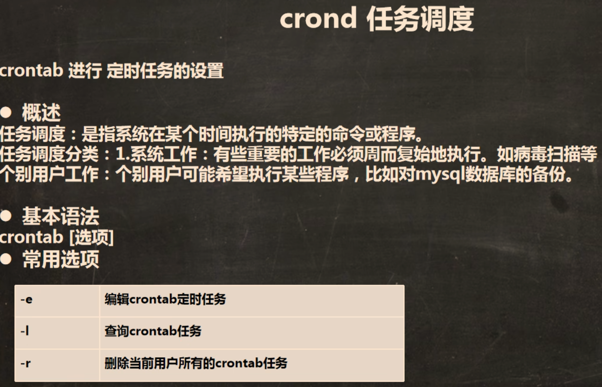

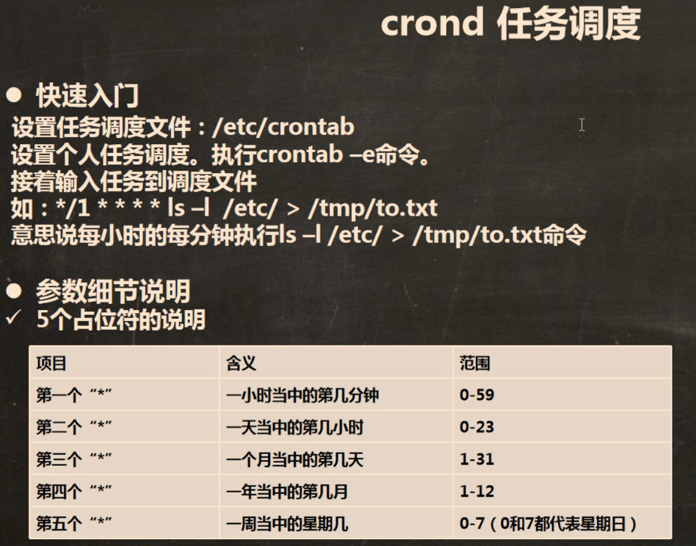

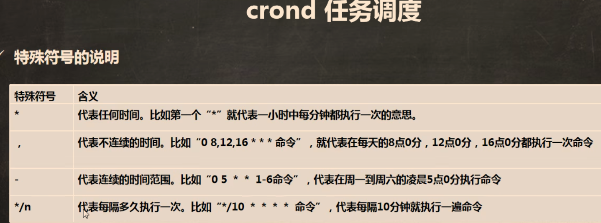

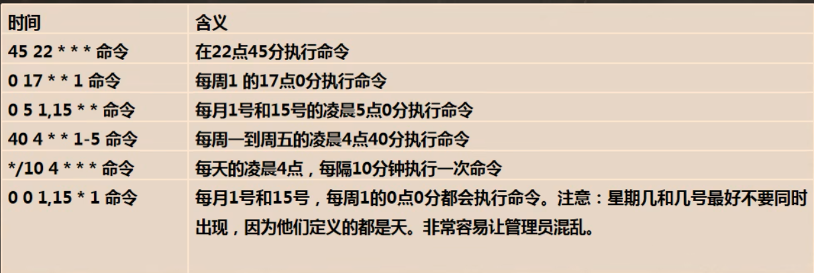

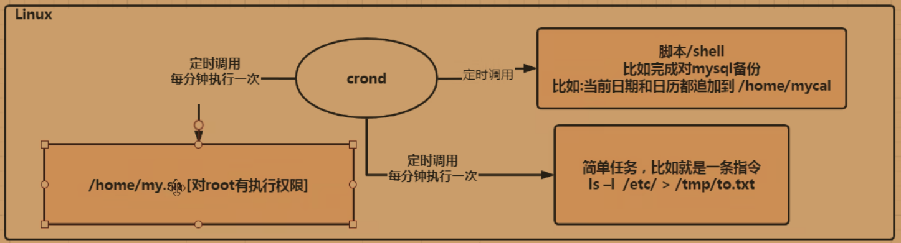

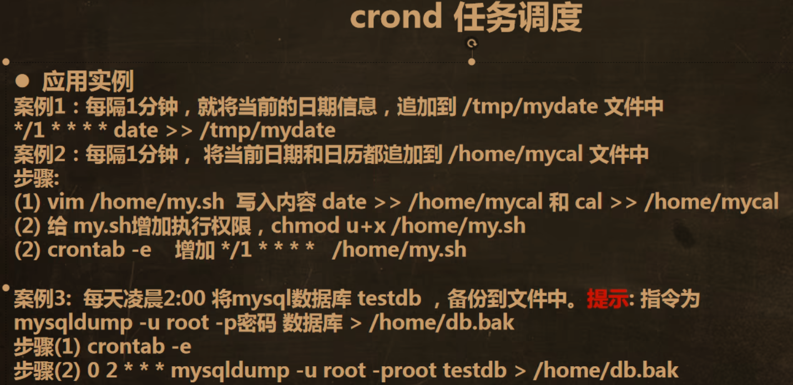

___

## 2.at定时任务

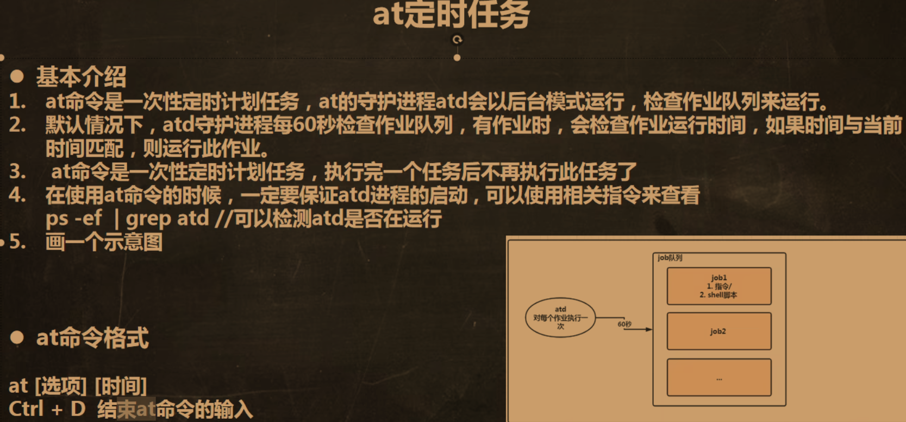

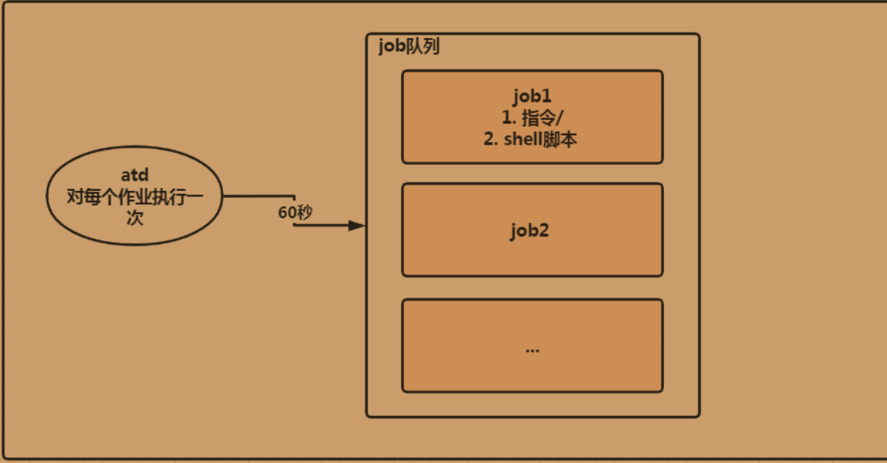

## 查看当前进程：ps -ef

### ps -ef：查看当前全部进程

### ps -ef | grep 进程名：筛选查看进程

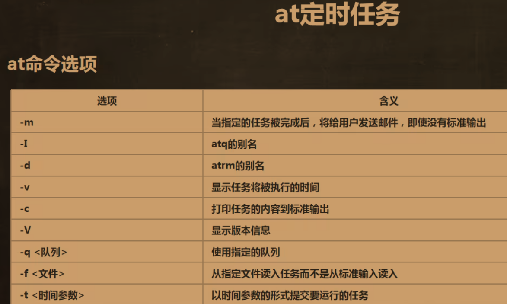

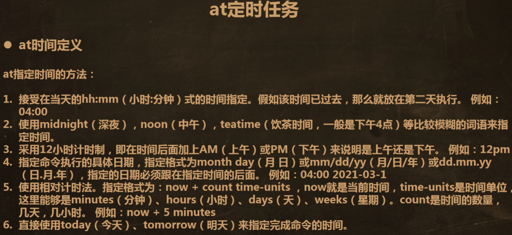

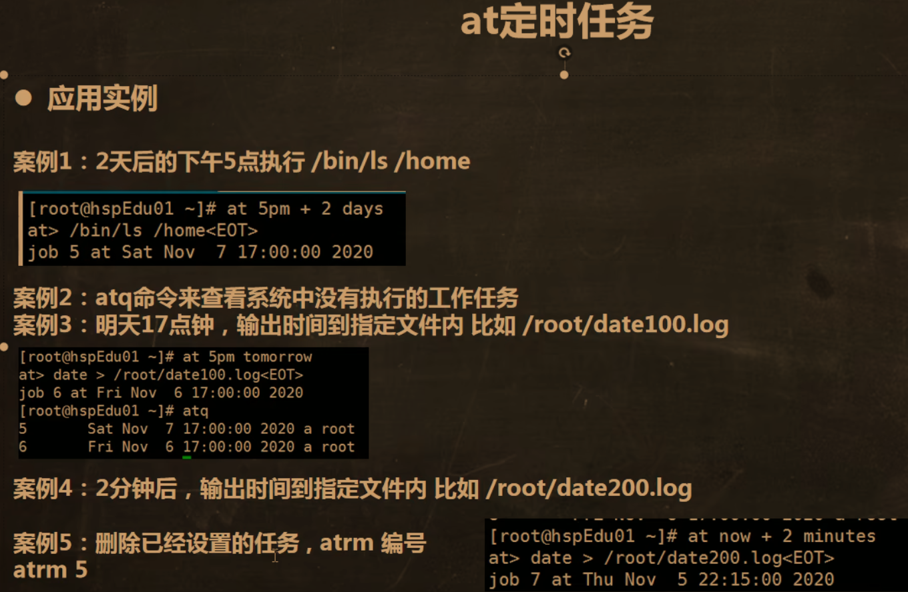

### 使用方法：

```
at now + 2 minutes（at + 时间）
at> date > /home/date.txt（具体任务）
Ctrl + D 两次退出编辑
```

> [!NOTE]
>
> #### 查看at任务：atq
>
> #### 删除at任务：atrm 任务编号

