# Linux09_磁盘分区

## 1.原理

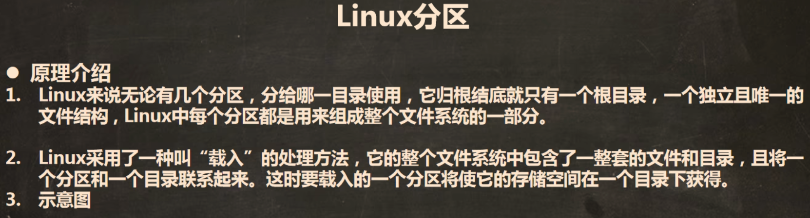

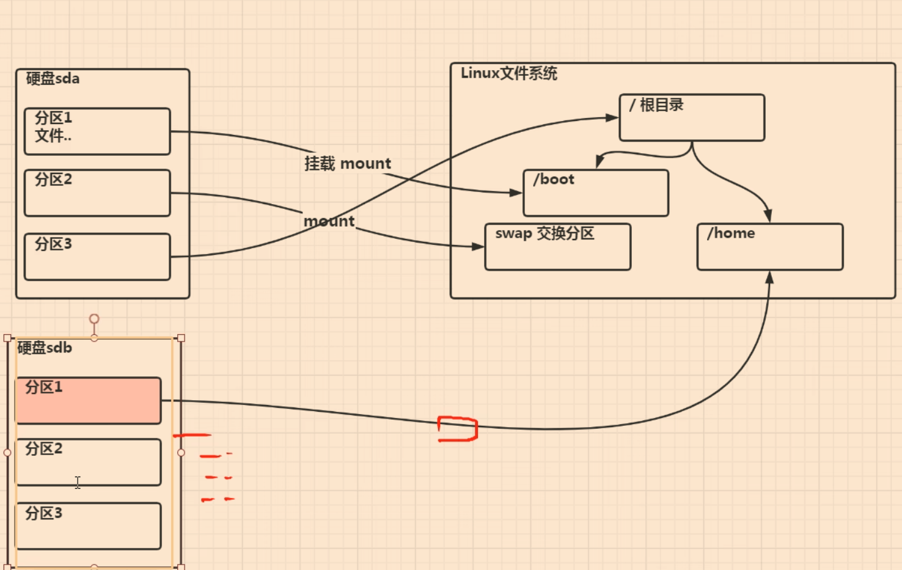

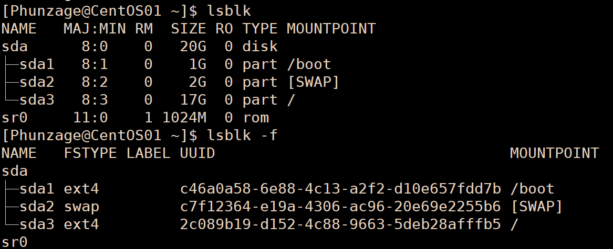

## 2.虚拟机增加硬盘

https://www.bilibili.com/video/BV1Sv411r7vd/?p=59

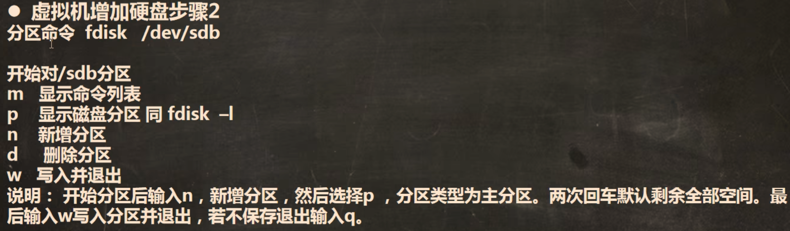	

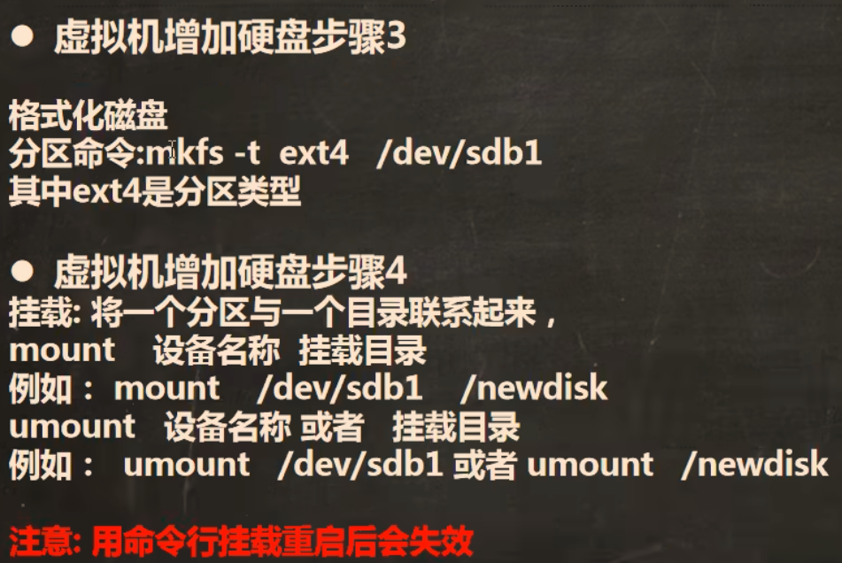

## 2.1具体步骤（一次性挂载）：

	

### 1.加载磁盘

##### 	1.虚拟机设置，添加磁盘，此时会多出来一个.vmdk的文件

##### 	2.重启Linux，使磁盘加载，此时使用lsblk查看磁盘信息，显示加载成功

### 2.创建分区

	

##### 使用fdisk /dev/sdb，进入分区界面，按 m 显示命令列表

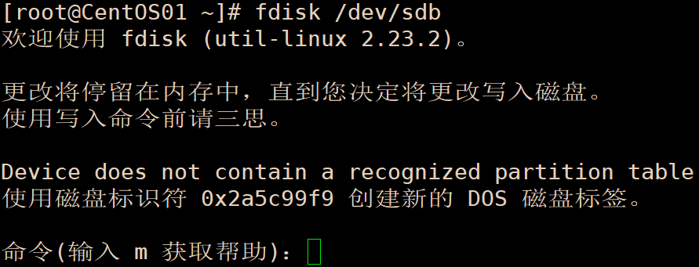	

##### 按 n 创建新分区，按 p 选择创建主分区

	

##### 分区号填几就创建几个分区，默认为1，即创建一个分区

	

##### 默认时回车

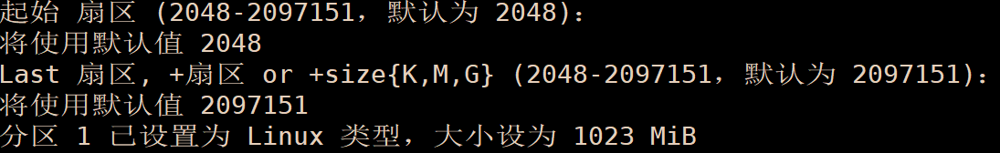	

##### 按 w 保存退出，lsblk 查看，显示分区成功

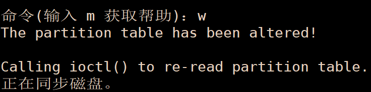	

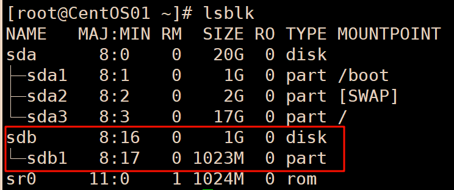	

### 3.格式化分区（指定分区的文件类型）

##### mkfs -t ext4 /dev/sdb1（将 /dev/sdb1 格式化为ext4）

### 4.挂载：将分区与一个目录联系

##### mount 分区名 目录名（e.g. mount /dev/sdb1 /newdisk）

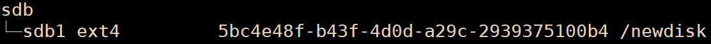	

### 5.卸载分区与目录的关系

##### umount 分区名 目录名（e.g. umount /dev/sdb1 /newdisk）

## 2.2永久挂载：

	

### 进入后用vim 命令yy p复制粘贴输入需要挂载的id等

___

## 3.磁盘情况查询

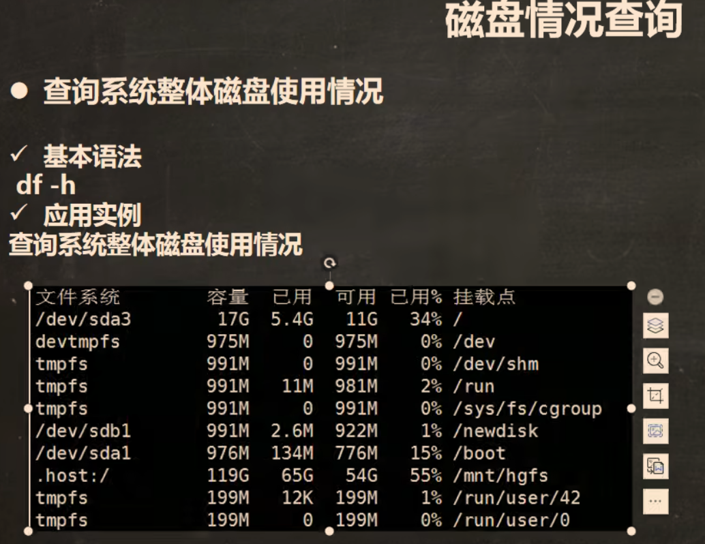	

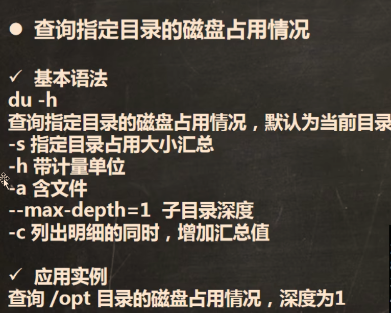	

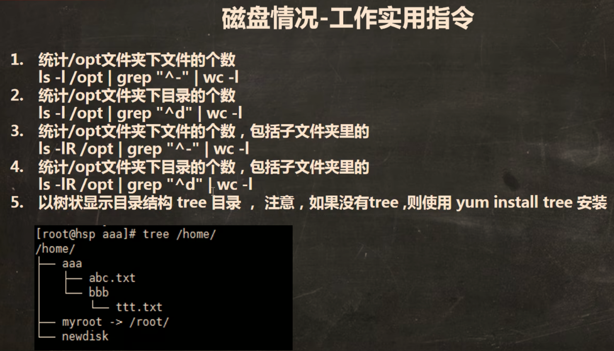

### 其中：

### grep筛选中的 "^-" 是只筛选文件（文件类型开头为-，见44.）；目录为 "^d" 

### wc -l 为统计个数

### ls -lR：将子文件夹包括在内