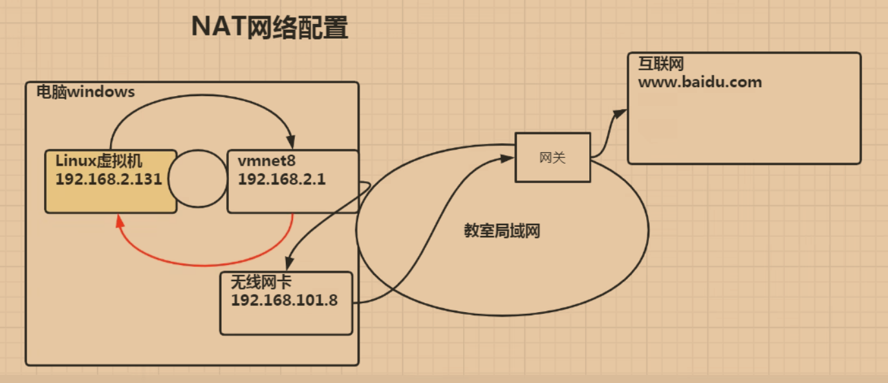
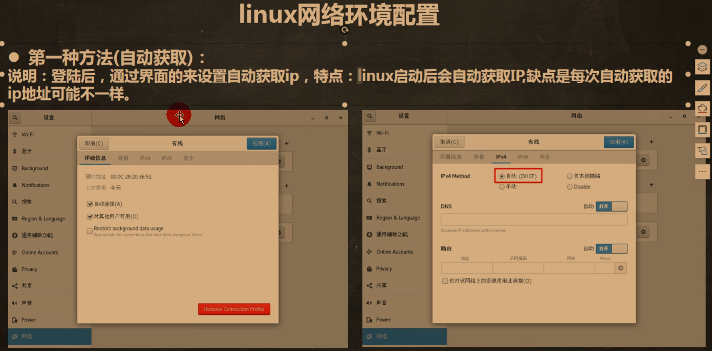
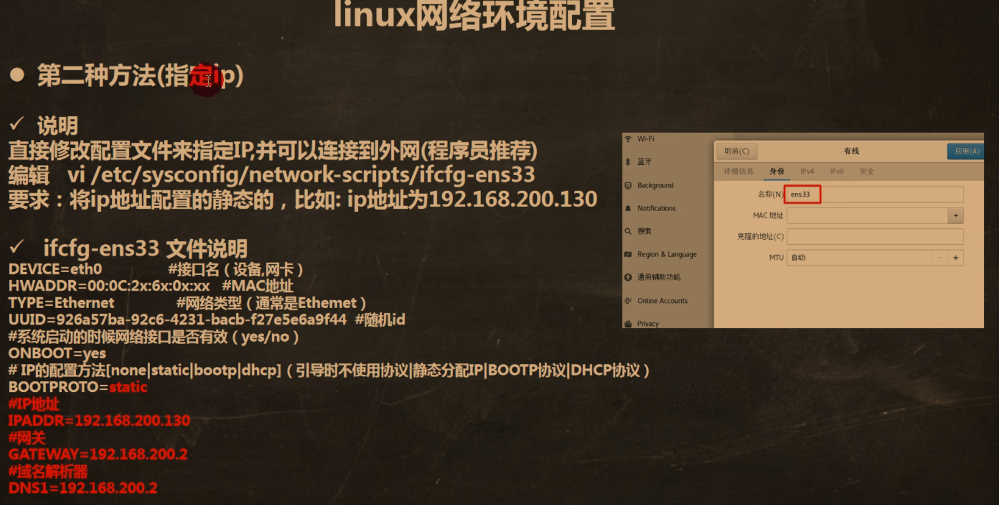
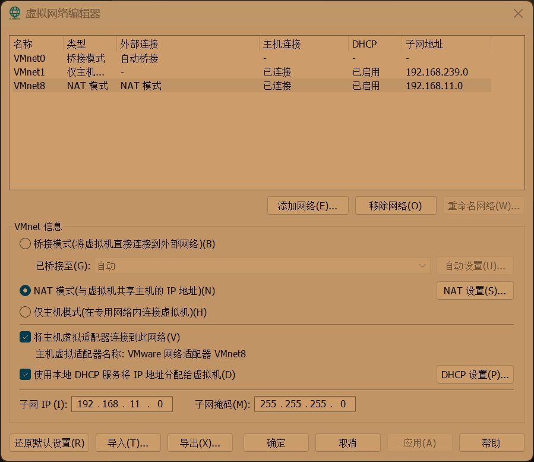
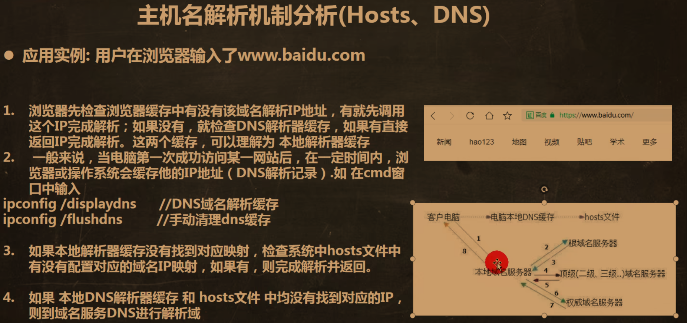

# Linux10_网络配置

## 1.NAT网络

___

## 2.设置ip

### 第二种：

#### cd /etc/sysconfig/network-scripts

#### vim ifcfg-ens33

#### 把BOOTPROTO改成"static"

#### 加入：

#### IPADDR="192.168.200.130"	ip地址

#### GATEWAY="192.168.200.2"	网关

#### DNS1="192.168.200.2"		域名解释器

### 再去虚拟机网络界面修改子网和NAT设置

	

### 重启完成

___

## 3.修改主机名

### 修改主机名：vim /etc/hostname

### 原理：

