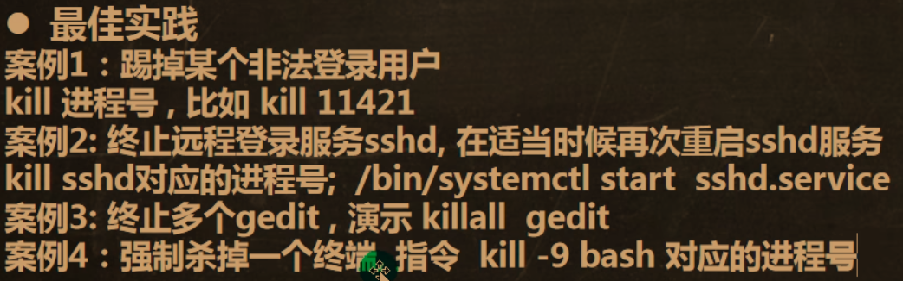

# Linux11_进程管理

## 1.基本介绍

### windows的pid

___

## 2.Linux查看进程

### 一般 ps -aux 三个混合使用，使用 more 进行筛选

## 3.终止进程

___

## 4.查看进程树

___

## 5.服务（进程）管理

### 1.service服务（老版服务，用途较少，CentOS7之前较多）

###### 	原理图

##### 	tab选择

___

### 2.systemctl（新版服务，用途较多，CentOs7之后）

___

## 6.防火墙与进程相关

### 以远程登陆 telnet 为例

### telnet成功的两个条件：1.防火墙关闭防护；2.防火墙开启防护 但 防火墙内的端口开启（如6下图）

#### 1.开关防火墙用5.2 systemctl 命令

#### 2.打开防火墙的端口相关：

##### firewall-cmd --permanent --add-port=端口号/协议：打开端口

##### firewall-cmd --permanent --remove-port=端口号/协议：关闭端口

##### firewall-cmd --reload：重新载入生效

##### firewall-cmd --query-port=端口/协议：查看端口是否开放

___

## 7.动态查看进程top

	

___

## 8.监控网络状态

### （协议	接收	发送	本地地址				外部地址				状态			pid）
