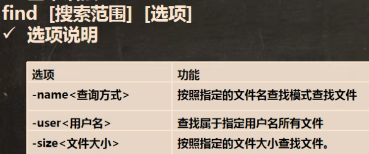
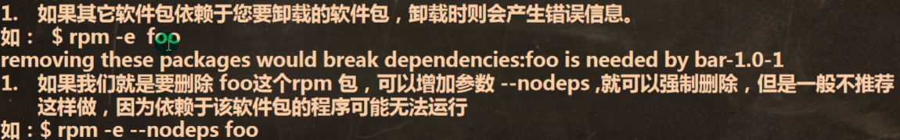

# Linux指令

## 1.进入到：cd

#### 		进入上级目录：cd ..（cd和..之间有个空格）

#### 		进入当前目录的家目录：cd ~或cd（root的家目录是/root；其他用户的家目录是/home/用户名）

___

## 2.解压：tar -zxvf   (xx具体的文件名.tar.gz)

___

## 3.安装（执行）：./

#### 可以执行.sh文件

___

## 4.检测Linux中gcc是否安装：gcc -v

___

## 5.显示文件夹下所有文件：ls

#### 		ls -a：显示隐藏文件，ls -l：以单列方式显示详细文件（可简写为ll）；可一起使用，ls -al或ls -la

#### ls -lh：以人能看懂的形式呈现（多用在将字节显示为兆）

#### 		ls /文件夹名 -al或ls -al /文件夹名：显示指定目录下的所有文件（e.g. ls /root -al）

___

## 6.显示Linux的ip地址：ifconfig

____

## 7.重启Linux：reboot

____

## 8.关机：

#### 			shutdown -h now：现在立刻关机

#### 			shutdown -h 1：1min后关机

#### 			shutdown -r now：现在重启计算机  ==  reboot

____

## 9.注销账户：logout

#### 			但要注意logout在图形界面不能使用！

#### 			（与之类似）：exit，也可登出账户

###### 				注意：`logout` 更专注于结束登录会话，而 `exit` 是一个更通用的命令，用于从各种环境退出。

###### 						在Linux图形界面的终端，可以使用 exit 以退出终端

___

## 10.添加用户：

#### 			useradd

#### 			useradd -d /home/test phz

____

## 11.显示当前用户（文件）在哪个目录下：pwd

## 12.更改用户密码：passwd 用户名

____

## 13.删除用户：

#### 			userdel 用户名（保留家目录，但已无法登入）

#### 			userdel -r 用户名 （彻底删除）

___

## 14.切换用户：su - 用户名

## 15.访问用户信息：id 用户名

## 16.查看当前用户和登录用户的信息：who am i

___

## 17用户组相关：

#### 			1.增加用户组：groupadd 用户组名

#### 			2.删除用户组：groupdel 用户组名

#### 			3.增加用户时直接加上组：useradd -g 用户组名 用户名（此时就创建了一个新用户）

#### 			4.先创建一个用户组，再把一个用户添加到该组：上面1.3.

#### 			5.更改所在的组：usermod -g 新用户组名 用户名

#### 6.修改文件所在组：chgrp 新组名 文件名

#### 7.递归修改目录下的文件及文件夹的所在组：chgrp -R 新组名 文件名

____

## 18.更改运行级别：

#### 		init 3/5

___

## 19.帮助命令：

#### 	man（显示完信息后按 “q” 键退出），help

____

## 20.显示文件的绝对路径：pwd

___

## 21.创建目录：

#### 	mkdir（默认只能创建一级目录）

#### 	mkdir -p /目录名/目录名/目录名

___

## 22.删除目录：

#### 	rmdir（默认只能删除空目录）

#### 	rm -r 目录名（可以删除有内容的目录）（看第25条）

___

## 23.创建新文件：touch

> [!NOTE]
>
> ###### Linux下，目录可以理解为文件夹，文件即单个有扩展名的文件

___

## 24.拷贝文件到指定目录：

#### 	cp 拷贝文件 目标目录

#### 	cp -r 拷贝目录 目标目录（拷贝整个目录到目标目录）

#### 	\cp（强制覆盖不提示，适用于原目录与目标目录文件相似度极高的情况）

____

## 25.删除文件：

#### 	rm 文件名

#### 	rm -f 强制删除不提示

#### 	rm -r 递归删除整个目录

#### 	rm -rf 强制删除整个目录不提示

____

## 26.移动和重命名文件：

#### mv 旧文件夹名 新文件夹名

#### mv 原文件夹位置 新文件夹位置

#### 可结合使用，即边移动边重命名

___

## 27.查看但不修改文件（只读）：cat

#### cat 文件名

#### cat -n 文件名（显示行号）

#### *cat -n 文件名 | more*

___

## *28.*more 指令（管道命令，可以单独使用也可以和其他与内容有关的指令一起使用）：

	

#### more 文件名

___

## *29.*less指令（和more用法差不多但功能更加强大）

> [!NOTE]
>
> #### 动态加载，处理大文件时，看哪一部份就只加载那一部分，耗费资源少，效率高（和vim比较）

	

#### less 文件名

____

## 30.输出内容到控制台：echo

#### echo $PATH：输出环境变量

#### echo $HOSTNAME：输出主机名称

#### echo "hello_world"：输出内容（hello_world）到控制台

#### echo "内容" >> 文件：追加内容到文件末尾（看33.）

___

## 31.查看文件开头部分：head

#### head 文件名（默认显示前10行）

#### head -n 行数 文件名（查看文件头几行内容）

___

## 32.查看文件结尾部分：tail

#### tail 文件名（查看文件尾10行内容）

#### tail -n 行数 文件名（查看文件尾几行内容）

#### tail -f 实时追踪该文档的所有更新（Ctrl+c退出）

___

## 33.输出重定向和追加：>；>>

	

> [!NOTE]
>
> #### 其中3)多用于复制粘贴

___

## 34.创建快捷方式（符号连接）（软连接）

#### ln -s 目标文件 链接名

___

## 35.查看历史命令：history

#### history 默认查看历史命令

#### history 数字 查看最近的几条命令

#### !数字编号 执行历史记录里第几条指令

___

## 36.显示当前日期：date

	

#### 设置日期：date -s "2024-07-20 16:11:02"

## 37.显示当前日历：cal

#### cal 2024 显示一整年日历

____

## 38.搜索指令：

### 1.find

	

### 2.locate：快速定位文件路径，第一次使用前先用updatedb创建路径数据库（应定期更新）

### 3.which：查看某个指令在哪个目录下

___

## 39.筛选查找：grep

#### grep -n（显示行号）-i（不区分大小写）

##### 例：1.cat /home/hello.txt | grep -n "hello"

##### 2.grep -n "hello" /home/hello.txt 

#### 都为在hello.txt中，找到hello并显示行号（查询多个"关键字\\|关键字"）

___

## 40.解压缩相关命令：

### 1.gzip 文件：压缩（只能将文件压缩为*.gz），gunzip 文件.gz：解压————一般用于文件

### 2.zip和unzip

#### zip -r（递归压缩目录）文件名.zip 目标文件夹————一般用于文件夹

#### unzip -d（指定存放目录）指定存放文件夹 文件名.zip

##### 例：zip -r myhome.zip /home

##### unzip -d /opt/ttt /home/myhome.zip

### 3.tar（压缩c；解压x）

##### tar -zcvf 文件名.tar.gz 被压缩的目标目录

##### tar -zxvf 文件名.tar.gz -C 解压到目标目录

___

## 41.查看文件所有者：ls -ahl

## 42.更改文件所有者：chown

### chown 用户名 文件名

### chown 用户名:所在组 文件名（改变所有者和所在组）

### chown -R 用户名 文件夹（递归将文件夹和其下文件都改变所有者）

___

## 43.更改文件所在组：chgrp 组名 文件夹

## 44.修改文件权限：

	

### +：增加权限，-：去除权限，=：赋予权限；u：所有者，g：所在组，o：其他组，a：所有人

### chmod u=rwx,g=rw,o=r 文件名

### chmod 数字 文件名

> [!NOTE]
>
> #### r：4，w：2，x：1组合即可，最大为7

___

## 45.定时任务调度：cound；at

### 1.cound（可以一直执行的任务）

###### 	原理

#### crontab -e：进入任务调度编写模块

##### * * * * * （时间）（编写任务）

#### crontab -l：列出当前用户部署的定时任务

#### crontab -r：删除当前用户的所有任务调度

###### 

	

> [!NOTE]
>
> ### 任务调度可以和shell命令结合使用

### 2.at（只执行一次的任务）

###### 	原理

### 使用方法：

```
at now + 2 minutes（at + 时间）
at> date > /home/date.txt（具体任务）
Ctrl + D 两次退出编辑
```

	

> [!NOTE]
>
> #### 查看at任务：atq
>
> #### 删除at任务：atrm 任务编号

___

## 46.查看当前进程：ps -ef

### ps -ef：查看当前全部进程

### ps -ef | grep 进程名：筛选查看进程

___

## 47.查看所有设备挂载情况：lsblk

### lsblk：查看所有设备挂载情况

### lsblk -f：详细查看所有设备挂载情况

___

## *48.挂载磁盘方法（root权限）：*

	

##### 涉及命令

### 2.创建分区	

##### 使用fdisk /dev/sdb，进入分区界面，按 m 显示命令列表

### 3.格式化分区（指定分区的文件类型）

##### mkfs -t ext4 /dev/sdb1（将 /dev/sdb1 格式化为ext4）

### 4.挂载：将分区与一个目录联系

##### mount 分区名 目录名（e.g. mount /dev/sdb1 /newdisk）

### *卸载分区与目录的关系*

##### umount 分区名 目录名（e.g. umount /dev/sdb1 /newdisk）

___

## 49.磁盘情况查询：df -h（h为以人类能看懂的方法）

___

## 50.查询指定目录下的磁盘使用情况（各文件占据多少空间）：du -h

	

### 其中 -h -a -c 可一起连用（e.g.：查询/opt目录下的磁盘使用情况，深度为1：du -hac --max-depth=1 /opt）

___

## 51.磁盘实用指令：ls、grep、wc等

	

### 其中：

### grep筛选中的 "^-" 是只筛选文件（文件类型开头为-，见44.）；目录为 "^d" 

### wc -l 为统计个数

### ls -lR：将子文件夹包括在内

___

## 52.查看主机名称：hostname

## 53.修改主机名：vim /etc/hostname

___

## 54.查看Linux进程：ps

	

### 一般 ps -aux 三个混合使用，使用 more 进行筛选

### ps -aux | grep 进程名：查看是否有某进程

### ps -ef：以全格式显示当前所有进程（-e：显示所有进程，-f：以全格式）

___

## 55.终止进程：kill和killall

### kill 选项 进程号：通过进程号杀死进程

##### 	1.kill 用户进程号：踢掉某个非法登录用户

##### 	2.终止远程登录服务sshd：kill sshd 对应的进程号

##### 	在适当时候再次重启sshd服务：/bin/systemctl start sshd.service

##### 	3.kill -9 bash 对应的进程号：强制杀掉一个终端指令对应的进程号（可用于关闭活动中的进程）

### killall 进程名称：通过进程名称杀死进程

##### 	1.killall gedit：终止多个gedit（用于关闭多个文档）

___

## 56.查看进程树：pstree

### pstree -p：以树的形式显示进程的pid

### pstree -u：以树的形式显示进程的用户名

___

## 57.查看service服务：ls -l /etc/init.d（与61区别）

> [!NOTE]
>
> ### 在centoS7.0后，很多服务不再使用service，而是使用systemctl

### service 服务名 选项（start，stop，restart，reload（重载），status（查看状态））

## 58.查看全部服务名（不区分service和systemctl）：setup

___

## 59.运行级别（一般用3和5）

### 运行级别3：multi-user.target

### 运行级别5：graphical.target

### 查看系统运行级别：systemctl get-default

### 更改系统运行级别：systemctl set-default 运行级别

___

## 60.查看并给服务的各个级别设置自启动和关闭:chkconfig

### 1.查看

#### chkconfig：查看服务在各个级别的启动状态

#### chkconfig --list（| grep 筛选项）：查看筛选的服务在各个级别的启动状态

#### chkconfig --list 服务名 / chkconfig 服务名 --list：查看 某项 服务在各个级别的启动状态

### 2.设置

#### chkconfig --level 级别 服务名 on/off：将某一级别的某项服务打开或关闭（重启生效）

___

## 61.查看systemctl服务：ls -l /usr/lib/systemd/system（与57相区别）

### ls -l /usr/lib/systemd/system | grep 服务名：筛选具体的 systemctl 服务名

### （e.g.：ls -l /usr/lib/systemd/system | grep firewalld（防火墙））

#### 1.systemctl list-unit-files | grep 服务名：查看服务的开机启动状态

#### 同 systemctl is-enabled 服务名：查询某个服务是否开机自启动

#### 2.systemctl enable 服务名：将某服务设为开机自启动（永久性）

#### 3.systemctl disable 服务名：取消某服务的开机自启动（永久性）

> [!NOTE]
>
> ##### （临时性启动和关闭）systemctl  [start / stop / restart（重启）/ status（状态）]  服务名

___

## 62.防火墙相关：firewall-cmd

### 以远程登陆 telnet 为例

### telnet成功的两个条件：1.防火墙关闭防护；2.防火墙开启防护 但 防火墙内的端口开启（如6下图）

#### 1.开关防火墙用 61. systemctl 命令

#### 2.打开防火墙的端口相关：

##### firewall-cmd --permanent --add-port=端口号/协议：打开端口

##### firewall-cmd --permanent --remove-port=端口号/协议：关闭端口

##### firewall-cmd --reload：重新载入生效

##### firewall-cmd --query-port=端口/协议：查看端口是否开放

	

## 63.查看服务所属的协议（监控网络状态）：netstat -anp | more

### netstat -an：按一定顺序排列列出

### netstat -anp：按一定顺序排列列出并显示哪个进程在调用

### netstat -anp | grep 进程名：筛选出正在调用的进程

	

___

## 64.动态查看进程：top

### top -d 数字：指定命令每隔几秒更新，默认是三秒

### top -i：使top不显示任何闲置或者僵死进程

### top -p：通过指定监控进程id来仅仅监控某个进程的状态

### 在 top 界面：

##### 输入P，以CPU使用率排序；M，以内存的使用率排序；N，以 pid 排序

##### u：用户名：查看该用户名的进程；k pid号：结束某进程

___

## 65.RPM和YUM

### 1.rpm

#### rpm -qa | grep 软件包名：查看当前系统是否安装了此软件 == rpm -q 软件包名

	

#### rpm -qi 软件包名：查询软件包信息

#### rpm -ql 软件包名：查询软件包中的文件

#### rpm -qf 文件全路径名：查询文件所属的软件包

#### rpm -e rpm包名：卸载软件

	

#### rpm -ivh rpm包全路径名：安装rpm包

	

### 2.yum

#### yum list | grep 软件名：查询yum服务器是否有需要安装的软件

#### yum install yum包：安装软件

___

## 66.创建服务器集群（连接另一个linux）：ssh

### ssh 目标用户名@ip号

#### （e.g. ssh tom@192.168.200.130）

___

## 67.查看系统运行内存：free -h（h：以人类能看懂的方式）

## 68.查看系统版本：uname -a

___

## 69.下载链接或文件：wget

### wget 链接

___


# 附vim指令（一般模式下）：

## 1.yy：复制当前行

## 2.nyy：向下复制n行

## 3.p：粘贴

## 4.dd：删除当前行

## 5.ndd：删除向下n行

## 6.查看用户组相关：

1. ##### vim /etc/passwd

   ###### 用户(user)的配置文件，记录用户的各种信息每行的含义:用户名:口令:用户标识号:组标识号:注释性描述:主目录:登录Shell

2. ##### vim /etc/shadow 

   ###### 文件口令的配置文件每行的含义:登录名:加密口令:最后一次修改时间:最小时间间隔:最大时间间隔:警告时间:不活动时间:失效时间:标志

3. ##### vim /etc/group 

   ###### 文件组(group)的配置文件，记录Linux包含的组的信息每行含义人:组名:口令:组标识号:组内用户列表

	
